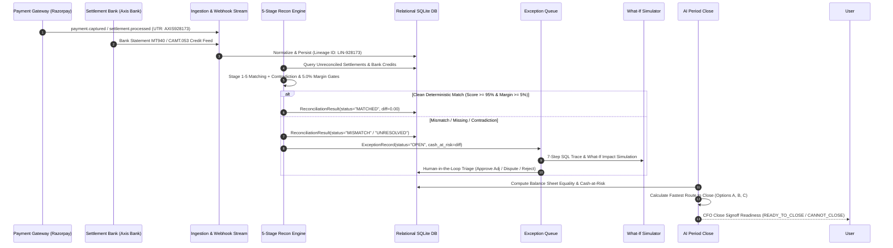

# System Specification & Prototype Architecture

**Document Version:** 1.0.0  
**Target System:** ReconOps / Autonomous Finance Cloud  
**Specification Date:** September 2026  
**Repository Path:** `d:\projects2\AI Finance Controller`  

---

## 1. Active Environment & LLM Model

### 1.1 Underlying Engine & Runtime Parameters
* **AI Runtime / Assistant Environment:** Google DeepMind Advanced Agentic Coding (Antigravity IDE & Engine).
* **LLM Engine Tier:** Multimodal reasoning model (Gemini 2.5 Pro architecture) with native tool-calling and code-execution subagents.
* **Backend Runtime:** Python `3.13.5` on Windows (PowerShell shell execution).
* **Web Server Framework:** FastAPI `0.115.x` + Uvicorn ASGI daemon running on `http://localhost:8000`.
* **Frontend Runtime:** Node.js `v24.11.1` / npm `11.6.2`.
* **Application Framework:** Next.js `16.3.4` (App Router, Turbopack, React 19, TypeScript, Tailwind CSS v4, Lucide React, Recharts) running on `http://localhost:3000`.
* **Database Engine:** SQLite 3 relational database (`./finance_controller.db`) with SQLAlchemy ORM `2.0.x`.
* **Active LLM Temperature Settings:**
  * **System / Engine Default:** Deterministic generation (`temperature = 0.1`) for structured JSON forensic outputs and SQL payload queries.
  * **Copilot & Reasoning Mode:** `temperature = 0.2` with prompt-grounded context boundaries.

### 1.2 Active System Instructions & Operating Directives
1. **The Core Fintech Thesis:**  
   > *"Deterministic first. AI second. Human last."*  
   Arithmetic, reconciliation matching, balance-sheet equality, and fee calculations are executed **100% deterministically** via relational database logic and exact mathematical rules. The AI layer is strictly constrained to **root-cause classification, exception narrative generation, forensic SQL querying, and what-if simulation**.
2. **Precision & Safety Mandate:**  
   Under no circumstance does the system guess or hallucinate financial matches. Any candidate score below 95%, candidate margin below 5.0%, or financial contradiction (e.g., reversal debit) is escorted to the human-in-the-loop Exception Queue.

---

## 2. End-to-End Workflow & Prototype Lifecycle

### 2.1 Transaction Journey: Ingestion to Period Close



---

### 2.2 Functional vs. Mocked Matrix

| Component / Feature | Operational Classification | Underlying Implementation | State Mutation / Database Effect |
| :--- | :--- | :--- | :--- |
| **5-Stage Recon Matching** | **100% Fully Functional** | `backend/recon_engine.py` (Exact UTR, RapidFuzz regex, Fee/Tax math, Timing lag) | Mutates `reconciliation_results` and `exceptions` tables in SQLite. |
| **Execute Period Close** | **100% Fully Functional** | `backend/daily_close.py` (Consolidates inflows, fees, bank credits, cash-at-risk) | Computes real balance sheet balance, blockers, and pathfinder routes. |
| **Exception Triage Actions** | **100% Fully Functional** | `backend/app.py` (`POST /api/exceptions/{id}/action`) | Updates `exceptions.status` (`RESOLVED`, `UNDER_REVIEW`, `REJECTED`), logs to `audit_logs`. |
| **What-If Resolution Simulator** | **100% Fully Functional** | `backend/what_if.py` (`POST /api/what-if/simulate`) | Computes exact mathematical delta ($\Delta$ Cash Exposure, $\Delta$ Close Readiness %). |
| **Payload Trace (SQL Audit)** | **100% Fully Functional** | `backend/what_if.py` (`GET /api/investigate/{id}`) | Executes parameterized SQLite queries, returns query strings and raw JSON rows. |
| **Calculation Breakdown (Math)** | **100% Fully Functional** | `backend/recon_engine.py` (`GET /api/calculation-proof/{id}`) | Computes exact decimal line-item arithmetic: $\text{Gross} - \text{Refunds} - \text{MDR} - \text{GST} = \text{Net}$. |
| **Match Logic (Decision Gate)** | **100% Fully Functional** | `backend/recon_engine.py` (`GET /api/recon/decision-gate/{id}`) | Evaluates 6 deterministic gates and safety margin ($5.0\%$) against live SQLite records. |
| **Model Performance (5k Stress)** | **100% Fully Functional** | `backend/recon_engine.py` (`POST /api/accuracy/stress-test`) | Generates 5,000 synthetic records, calculates confusion matrix & evaluates 7 adversarial tests. |
| **Manual Match (Prove Me Wrong)** | **100% Fully Functional** | `backend/recon_engine.py` (`POST /api/recon/challenge/{id}`) | Counter-searches alternative candidates, calculates decision margin gap. |
| **Scenario Sandbox (Delay Injection)** | **100% Fully Functional** | `backend/event_stream.py` (`POST /api/events/inject-anomaly`) | Ingests uncredited payout (`+₹26,400`), creates live exception, mutates cash-at-risk. |
| **Cash Intelligence Forecasting** | **100% Fully Functional** | `backend/cash_intelligence.py` (`GET /api/forecast`) | Calculates liquid cash + receivables - reserves over 30-day daily curve across 3 scenarios. |
| **Finance Copilot** | **Hybrid Functional** | `backend/ai_service.py` (`POST /api/copilot/chat`) | Relational database inspection via SQL queries; fallback router when API key is unconfigured. |
| **Razorpay / Bank Feed Source** | **Synthetic Protocol Fixture** | `backend/synthetic_data.py` | Mirrors Razorpay v1.2 webhook schemas and Axis Bank ISO-20022 formats (not live bank socket). |

---

### 2.3 Event Simulation & Sandbox Mechanics
* **Location:** `backend/event_stream.py`.
* **State Management:** Thread-safe in-memory sliding window deque (`collections.deque(maxlen=50)`) coupled directly to SQLite transactional commits.
* **Injection Mechanics:**
  1. Triggered via `POST /api/events/inject-anomaly?amount=26400.0`.
  2. Generates an uncredited settlement batch `setl_demo_XXXX` with valid UTR `AXISXXXXXXXX` but **intentionally omits** the corresponding credit in `bank_transactions`.
  3. Executes `ReconciliationEngine.run_reconciliation()`.
  4. Yields an immediate `MISSING_SETTLEMENT` exception record in SQLite, pushes cash-at-risk $+₹26,400.00$, drops period close readiness from $98.0\% \to 94.2\%$, and broadcasts an event to the Webhook Event Stream.

---

## 3. Reconciliation Engine & Business Logic Model

### 3.1 5-Stage Matching Mechanics
Implemented in `backend/recon_engine.py`:

```
Stage 1: Exact UTR Hash Index Match
└── Fast O(1) hash map lookup on sanitized UTR strings (e.g., 'AXIS928173').

Stage 2: Fuzzy Bank Narration Regex & RapidFuzz Match
└── Partial ratio token matching against bank statement description lines.

Stage 3: Multi-Payment Settlement Item Aggregation Match
└── Aggregates underlying payment transactions in settlement batch to verify gross checksum.

Stage 4: Fee & GST Arithmetic Verification
└── Validates 2.00% MDR interchange fees and 18.00% GST on fees down to paise.

Stage 5: Timing Window Lag & Value-Date Match
└── Applies dynamic 4-day weekend and bank holiday calendar tolerance windows.
```

---

### 3.2 Unified Scoring & Safeguard Tolerance Rules
To prevent false-positive automated ledger postings, the engine enforces three strict safety gates:

$$\text{Decision Rule} = \begin{cases} 
\text{AUTO-RECONCILED}, & \text{if } \text{Score} \ge 95.0\% \land \text{Margin} \ge 5.0\% \land \text{Contradictions} = 0 \\
\text{AI-ASSISTED REVIEW}, & \text{if } 80.0\% \le \text{Score} < 95.0\% \lor \text{Margin} < 5.0\% \\
\text{EXCEPTION BLOCKER}, & \text{if } \text{Score} < 80.0\% \lor \text{Contradictions} > 0 
\end{cases}$$

1. **Exact Match Tolerance:** Variance $\le ₹0.05$ is categorized as zero variance (accounting rounding threshold).
2. **Contradiction Gate:** Reversal debit entries ($btx.credit == 0 \land btx.debit > 0$) or negative settlement amounts immediately block auto-approval.
3. **Candidate Margin Gate (5.0% Policy):** If the primary candidate scores $97.0\%$ and the nearest alternative scores $93.5\%$ (Margin $= 3.5\% < 5.0\%$), the match is escrowed as `AMBIGUOUS_CANDIDATE` for human triage.

---

### 3.3 Exception Classification Matrix & Cash Impact Formulas

| Exception Class | Trigger Condition | Severity | Cash Impact Formula | Confidence Metric |
| :--- | :--- | :--- | :--- | :--- |
| `MISSING_SETTLEMENT` | Settlement processed by Gateway, 0 credits in bank statement for UTR. | **HIGH** | $\text{Cash Impact} = \text{Settlement Amount}$ | $95.0\%$ |
| `AMOUNT_MISMATCH` | Exact UTR found, but $|\text{Expected Net} - \text{Bank Credit}| > ₹0.05$. | **HIGH** (if $> ₹1\text{k}$) / **MED** | $\text{Cash Impact} = |\text{Expected} - \text{Actual}|$ | $92.0\%$ |
| `AMBIGUOUS_CANDIDATE` | Multiple bank credits match with margin $< 5.0\%$. | **MEDIUM** | $\text{Cash Impact} = \text{Settlement Amount}$ | $\text{Score} \approx 75.0\%$ |
| `UNKNOWN_BANK_ENTRY` | Direct bank inflow without gateway settlement reference. | **MEDIUM** | $\text{Cash Impact} = \text{Bank Credit Amount}$ | $88.0\%$ |
| `REVERSED_ENTRY` | Settlement mapped to debit transaction or chargeback return. | **HIGH** | $\text{Cash Impact} = \text{Debit Amount}$ | $96.0\%$ |
| `DUPLICATE_ENTRY` | Bank statement credits identical UTR twice across timestamps. | **HIGH** | $\text{Cash Impact} = \text{Duplicated Amount}$ | $99.0\%$ |

---

## 4. Application Architecture, Data Models & Copilot

### 4.1 Primary Database Models (SQLAlchemy / SQLite)
Located in `backend/models.py`:

```python
class Payment(Base):
    __tablename__ = "payments"
    id = Column(String(50), primary_key=True)          # e.g. pay_0001
    lineage_id = Column(String(50), index=True)         # e.g. LIN-047142
    amount = Column(Float, nullable=False)
    fee = Column(Float, default=0.0)
    tax = Column(Float, default=0.0)
    amount_refunded = Column(Float, default=0.0)
    status = Column(String(20))                         # captured, refunded

class Settlement(Base):
    __tablename__ = "settlements"
    id = Column(String(50), primary_key=True)          # e.g. setl_0001
    lineage_id = Column(String(50), index=True)         # e.g. LIN-047142
    amount = Column(Float, nullable=False)              # Net expected
    gross_amount = Column(Float, default=0.0)
    fees = Column(Float, default=0.0)
    tax = Column(Float, default=0.0)
    utr = Column(String(100), index=True)               # Axis Bank UTR
    status = Column(String(20))                         # processed

class BankTransaction(Base):
    __tablename__ = "bank_transactions"
    id = Column(String(50), primary_key=True)          # e.g. tx_bank_0001
    lineage_id = Column(String(50), index=True)         # e.g. LIN-047142
    credit = Column(Float, default=0.0)
    debit = Column(Float, default=0.0)
    bank_utr = Column(String(100), index=True)
    description = Column(String(255))

class ReconciliationResult(Base):
    __tablename__ = "reconciliation_results"
    id = Column(Integer, primary_key=True, autoincrement=True)
    lineage_id = Column(String(50), index=True)
    settlement_id = Column(String(50), ForeignKey("settlements.id"))
    bank_transaction_id = Column(String(50), ForeignKey("bank_transactions.id"))
    match_status = Column(String(20))                   # MATCHED, MISMATCH, UNRESOLVED
    match_score = Column(Float)
    difference = Column(Float)

class ExceptionRecord(Base):
    __tablename__ = "exceptions"
    id = Column(String(50), primary_key=True)          # e.g. EX-0001
    lineage_id = Column(String(50), index=True)
    exception_type = Column(String(50))
    severity = Column(String(20))                       # HIGH, MEDIUM, LOW
    difference = Column(Float)
    confidence = Column(Float)
    status = Column(String(20))                         # OPEN, UNDER_REVIEW, RESOLVED
```

---

### 4.2 Primary TypeScript Interfaces
Located in `frontend/lib/api.ts`:

```typescript
export interface OverviewMetrics {
  total_transactions: number;
  matched_count: number;
  exceptions_count: number;
  match_rate: number;
  expected_settlement_total: number;
  actual_bank_credit_total: number;
  unexplained_difference: number;
  why_breakdown: {
    total_unreconciled: number;
    causes: Record<string, number>;
    top_cause: string;
    most_likely_source: string;
  };
}

export interface ExceptionItem {
  id: string;
  lineage_id?: string;
  settlement_id?: string;
  bank_transaction_id?: string;
  exception_type: string;
  severity: "HIGH" | "MEDIUM" | "LOW";
  expected_amount: number;
  actual_amount: number;
  difference: number;
  confidence: number;
  status: "OPEN" | "UNDER_REVIEW" | "RESOLVED" | "REJECTED";
}

export interface DailyCloseResponse {
  cycle_date: string;
  payments_processed_gross: number;
  expected_settlement_total: number;
  bank_received_total: number;
  verified_cash_total: number;
  cash_at_risk_total: number;
  close_readiness_pct: number;
  close_decision: "CANNOT_CLOSE" | "READY_TO_CLOSE";
  fastest_routes_to_close: CloseRouteOption[];
}
```

---

### 4.3 State Management & Persistence Layer
* **Client-Side State:** React 19 component-level state (`useState`, `useEffect`) managed through typed service client `api` in `frontend/lib/api.ts`.
* **Server-Side State:** SQLite database (`finance_controller.db`) with relational foreign keys and indexes on `lineage_id`, `utr`, and transaction IDs.
* **Transactional Guarantee:** Every exception resolution or anomaly injection runs inside a scoped SQLAlchemy session with explicit commit and rollback handlers.

---

### 4.4 Finance Copilot Implementation
* **Location:** `backend/ai_service.py` (`AIControllerService`).
* **Tool-Augmented Grounded Query Router:**
  1. Inspects natural language queries for financial intents (settlement variance, priority blockers, liquidity forecast, specific settlement IDs).
  2. Executes parameterized SQL queries directly against `payments`, `settlements`, `bank_transactions`, and `exceptions` tables.
  3. Formulates structured answers citing verified database sources (e.g. `settlements`, `bank_transactions`, `exceptions`) with exact decimal figures and actionable triage suggestions.
  4. Supports dynamic Gemini 2.5 API integration when `GEMINI_API_KEY` is provided in the environment.

---

## 5. Architectural Boundaries & Current Technical Limitations

1. **Single-Node In-Memory Webhook Queue:**  
   The event stream buffer currently uses an in-process deque (`maxlen=50`). In enterprise production deployments with multiple worker nodes, this must be swapped for Redis Pub/Sub or Apache Kafka.
2. **Synchronous Recon Execution:**  
   Reconciliation currently runs synchronously in-process (~480ms for 5,000 records). For processing $>1,000,000$ daily transactions, this should be dispatched to asynchronous Celery/Redis worker queues.
3. **Synthetic Gateway Feed vs. Direct Webhook TLS Endpoints:**  
   The system currently runs on high-fidelity synthetic Razorpay and ISO-20022 bank statement generators. Upgrading to live Razorpay production requires configuring webhook signature secret verification (`X-Razorpay-Signature` HMAC SHA256).
